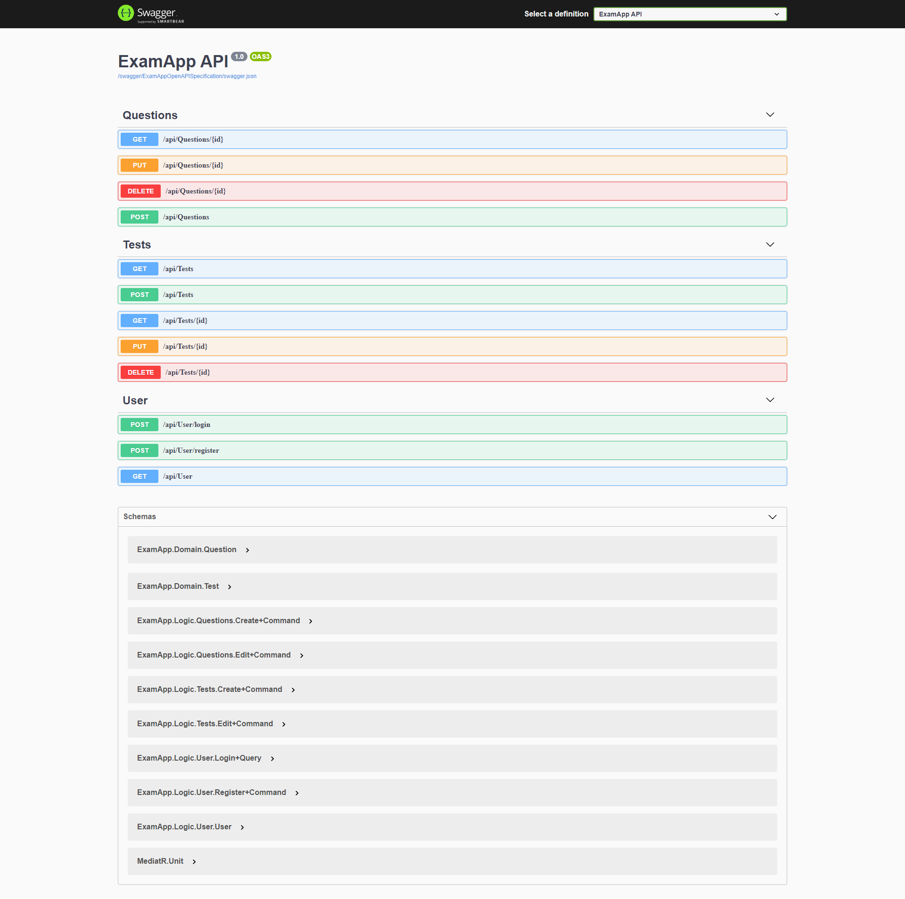
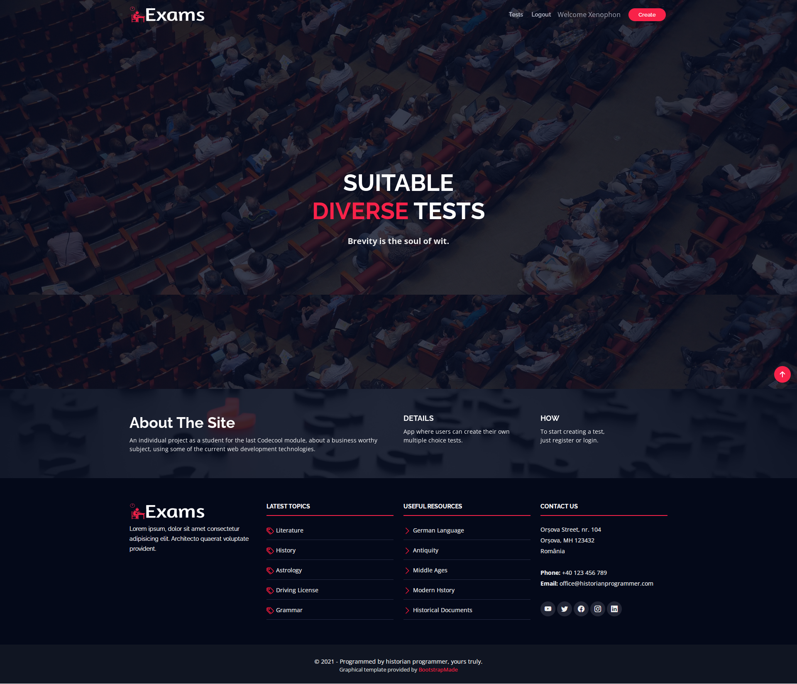
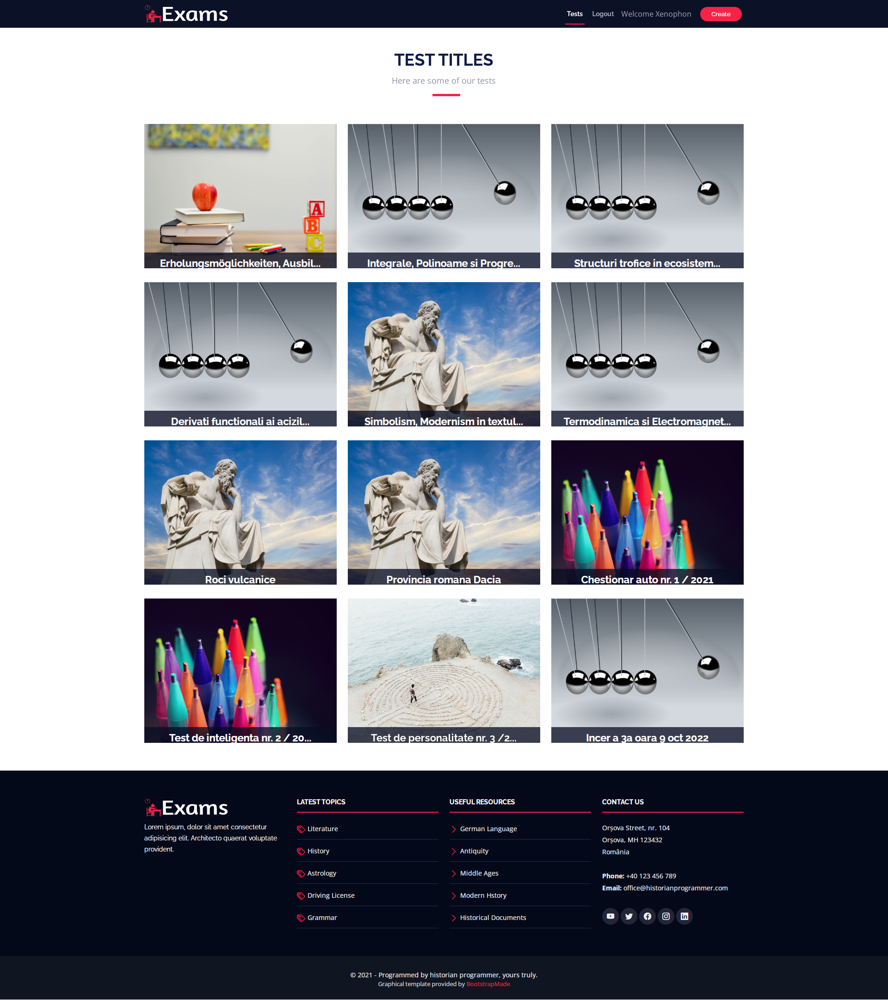

# Exam App project

###### This is an individual project created as part of Codecool's Job Hunt module.

---

## [1. Description](#description)
## [2. Technologies used](#technologies-used)
## [3. Installation](#installation)
## [4. Starting the solution](#starting-the-solution)
## [5. Implementation](#implementation)
   
---

## Description

The aim of this project is an application both for the classical school education system, as 
well as any other oranisation requiring online tests on diverse topics. 
A teacher or mentor can have an online test class students with evidence of the main data 
(student marks, times the test was taken).

---

## Technologies used

- Back-End section was created using:
.NET Core 3.1, Swagger, SQL Server, Entity Framework Core, EntityFramework Identity, JWT Tokens
- Front-End section was created using:
React, Axios, Final Forms, Toastify, Bootstrap 5
<br/><br/>
This project was created with [Visual Studio 2019](https://visualstudio.microsoft.com/vs/) ASP.NET Core Web API and Class library templates.
<br/><br/>
The Front End was bootstrapped with [Create React App](https://github.com/facebook/create-react-app).
<br/><br/>
The web design was implemented from a [BootstrapMade](https://bootstrapmade.com/free-website-templates/) free website template.

---

## Installation

In order for this project to run, you need an SQL Lite localdb connection to your IDE.
<br/><br/>
After downloading the repo, in order to create the project's SQL Lite database structure, 
open Package Manager Console, select __ExamApp.Data__ as default project and run:
```c#
Update-Database
```

Next, in order to install React project dependecies, go to __ExamApp.UI/client-app__ and run:
```javascript
npm update
```

---

## Starting the solution

Set __ExamApp.Domain__ as dependency for __ExamApp.Data__ and __ExamApp.Logic__.
<br/><br/>
Set __ExamApp.Logic__ and __ExamApp.Utils__ as dependencies for __ExamApp.API__.
<br/><br/>
Afterwards, you need to set you IDE to start multiple startup projects, with __ExamApp.UI__ 
as the first project and __ExamApp.UI__ as the second.

---

## Implementation

Swagger:


Home page:


Tests page:
